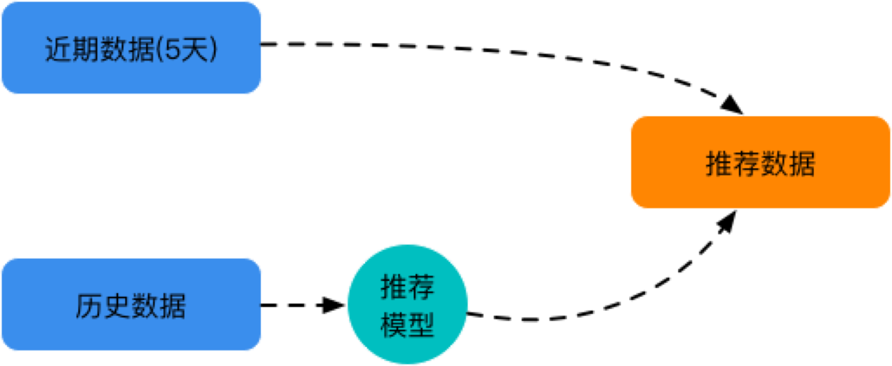

# Purchase Prediction

> 2017 Seed Cup Semi-Final Competition

## Introduction

1. Firstly, we need to extract **inherent features** and of users and products. Furtherly, we extracted **behavioural features** of users and the **interactive features** of products all from user's behaviors

2. We developed an **User-Product Purchasing Model**

3. We adopt user-based and product-based collaborative filtering to generate recommend products for users

## Environment

* macOS 10.14 High Sierra

* Python 2.7.10 

* XGBoost

* Pytorch

* Scikit-Learn

## Statement

**The code commited on this repository might not work much well as expected, because we adopted many intermediate steps and operations to collect the best result!**

## Licence

This project is under the **MIT Licence**

